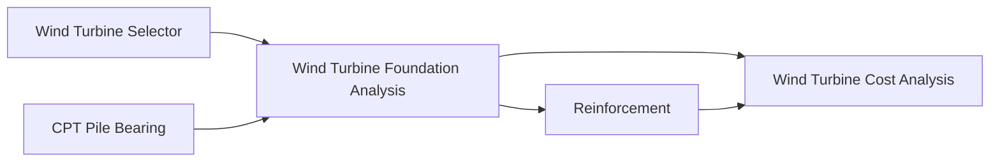

# Wind Turbine Foundation Workflow

This workflow connects the five live VIKTOR apps extracted by the notebooks in this folder.

## Nodes

| Node | Workspace | Entity | Primary method | Result |
| --- | ---: | ---: | --- | --- |
| Wind Turbine Selector | 2544 | 12164 | `view_turbine_data` | `data` |
| CPT Pile Bearing | 2564 | 12165 | `view_results` | `data` |
| Wind Turbine Foundation Analysis | 2651 | 12137 | `view_results` | `data` |
| Reinforcement | 2640 | 12166 | `view_results` | `data` |
| Wind Turbine Cost Analysis | 2647 | 12169 | `view_data` | `data` |

The foundation analysis result handoff is based on the app's `view_results` DataView. It returns maximum/minimum pile `Rz` plus governing `m_xD` and `m_yD` moment extremes. The SCIA sample app reads `sample_apps/scia/base_model.esa` from disk.

## Main Handoffs

| From | To | Mapping |
| --- | --- | --- |
| Selector | Foundation | `tower.base_diameter` -> `step_geo.sec_mast.mast_diameter` |
| Selector | Foundation | `tower.base_vert_force` -> `step_geo.sec_mast.mast_vertical_load` |
| Selector | Foundation | `tower.base_horiz_force` -> `step_geo.sec_mast.mast_horizontal_load` |
| Selector | Foundation | `tower.base_moment` -> `step_geo.sec_mast.mast_moment` |
| CPT | Foundation | `pile_info.length_item` -> `step_geo.sec_piles.pile_length` |
| CPT | Foundation | `pile_info.diameter_item` -> `step_geo.sec_piles.pile_diameter` |
| CPT | Foundation | `results.rc_d` -> capacity check against future pile reactions |
| CPT | Foundation | `calc_params.qc_tip_item` -> geotechnical stiffness calibration rule |
| Foundation | Reinforcement | design rule -> `tab_geometry.width = 1000 mm` representative strip |
| Foundation | Reinforcement | `step_geo.sec_plate.slab_thickness` -> `tab_geometry.height` after m-to-mm conversion |
| Foundation | Reinforcement | `Minimum m_xD+`, `Maximum m_xD-`, `Minimum m_yD+`, `Maximum m_yD-` -> `tab_loading.combinations` |
| Foundation | Cost | mast, plate, pedestal, and pile geometry -> `step_1` geometry and pile inputs |
| Reinforcement | Cost | `section.kg_m3` -> `step_1.rebar.plate_main_reinforcement` with a project reinforcement-intensity rule |

Use `wind_turbine_workflow.json` for machine-readable node metadata, graph icons, storage keys, and field-level mapping details.
