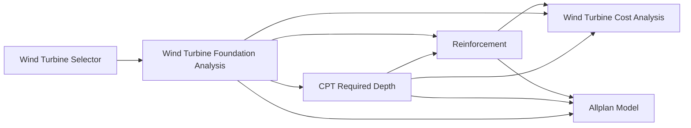

# Wind Turbine Foundation Workflow

This workflow connects the live VIKTOR apps extracted by the notebooks in this folder.

## Nodes

| Node | Workspace | Entity | Primary method | Result |
| --- | ---: | ---: | --- | --- |
| Wind Turbine Selector | 2544 | 12164 | `view_turbine_data` | `data` |
| CPT Required Depth | 2564 | 12165 | `view_required_depth` | `data` |
| Wind Turbine Foundation Analysis | 2677 | 12173 | `view_results` | `data` |
| Reinforcement | 2640 | 12166 | `view_optimise` | `data` |
| Wind Turbine Cost Analysis | 2647 | 12169 | `view_data` | `data` |
| Allplan Model | 2787 | 12509 | `bar_schedule` | `table` |

The foundation analysis result handoff is based on the app's `view_results` DataView. It returns maximum/minimum pile `Rz` plus governing `m_xD` and `m_yD` moment extremes. The SCIA sample app reads `sample_apps/scia/base_model.esa` from disk.

## Main Handoffs

| From | To | Mapping |
| --- | --- | --- |
| Selector | Foundation | `tower.base_diameter` -> `step_geo.sec_mast.mast_diameter` |
| Selector | Foundation | `tower.base_vert_force` -> `step_geo.sec_mast.mast_vertical_load` |
| Selector | Foundation | `tower.base_horiz_force` -> `step_geo.sec_mast.mast_horizontal_load` |
| Selector | Foundation | `tower.base_moment` -> `step_geo.sec_mast.mast_moment` |
| Foundation | CPT | `Maximum pile reaction (Rz)` -> `step2.sec_load.design_load` |
| Foundation | CPT | `params.step_geo.sec_piles.pile_diameter` -> `step2.sec_pile.pile_diameter` |
| CPT | Foundation params | required pile depth/length -> `step_geo.sec_piles.pile_length` via `set_params_in_node` without rerunning SCIA |
| Foundation | Reinforcement | design rule -> `tab_geometry.width = 1000 mm` representative strip |
| Foundation | Reinforcement | `step_geo.sec_plate.slab_thickness` -> `tab_geometry.height` after m-to-mm conversion |
| Foundation | Reinforcement | `Minimum m_xD+`, `Maximum m_xD-` -> two `tab_loading.combinations` with labels `Min m_xD+` and `Max m_xD-` |
| Foundation | Cost | mast, plate, pedestal, and pile geometry -> `step_1` geometry and pile inputs |
| Reinforcement | Cost | `design.kg_m3_item` -> `step_1.rebar.plate_main_reinforcement` with a project reinforcement-intensity rule |
| Foundation | Allplan | plate, pedestal, and pile geometry -> `geometry` inputs after m-to-mm conversion |
| CPT | Allplan | required pile length -> `geometry.pile_depth` after m-to-mm conversion |
| Reinforcement | Allplan | optimise output spacing and bar diameters -> matching `reinforcement` inputs where available |

The Allplan app's `bar_schedule` method is a TableView named "Visual geometry schedule". It does not currently expose a `DataView`; use the generated table as the model/schedule handoff. SCIA does not need new inputs for this mapping. If the Allplan model needs exact full-layout reinforcement counts, the reinforcement app should expose full radial/ring/pedestal/pile layout assumptions; its current `n_top` and `n_bot` values are representative-strip counts and should not be used as full-model bar counts.

For the current Allplan schema, `Spacing ctc (top & bottom)` from the reinforcement optimise view maps to circular/ring spacing and derives the radial bar count from the effective foundation perimeter divided by that spacing. The governing main bar diameter from `Top bar diameter` and `Bottom bar diameter` maps to both `ring_bar_diameter` and `top_radial_bar_diameter` because the current schema has one ring diameter and one radial diameter. Saved `stirrup_dia` maps only to ties and hoops, not radial main reinforcement. The schema has one `ring_*` family, not separate top and bottom circular ring families, so separate top/bottom circular reinforcement would require an Allplan app input tweak.

Allplan is a downstream post-processing step for optimization workflows. Do not run it for every candidate. After the optimization loop is complete, run it once for the selected best/final candidate after foundation, CPT, and reinforcement outputs for that candidate are active.

Use `wind_turbine_workflow.json` for machine-readable node metadata, graph icons, storage keys, and field-level mapping details.
